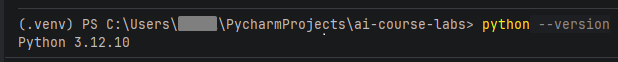
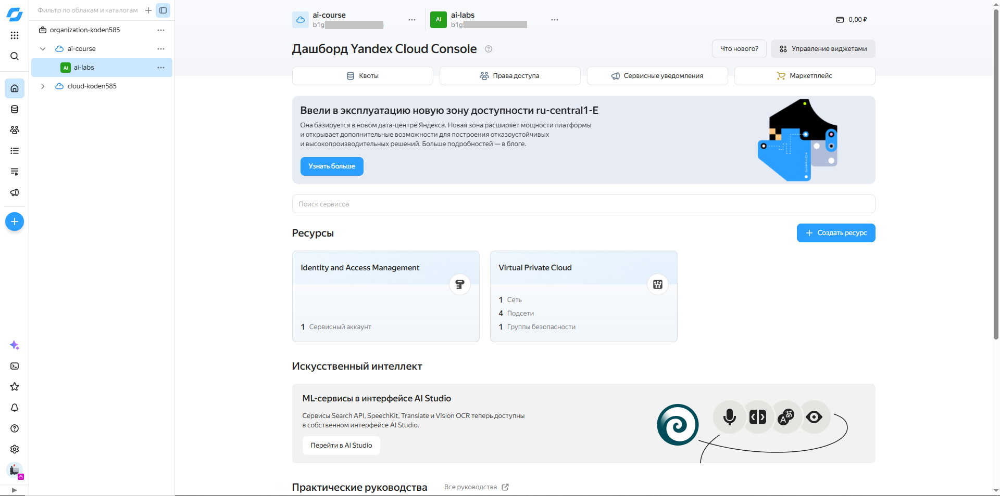
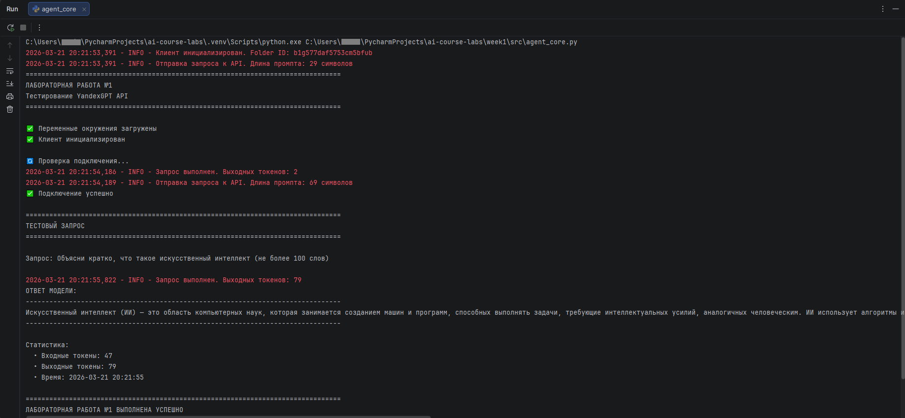
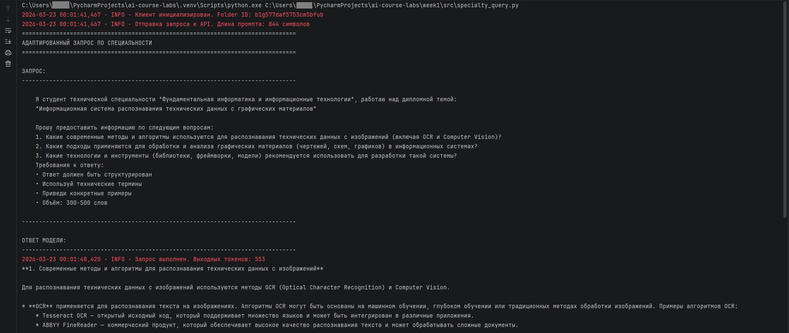
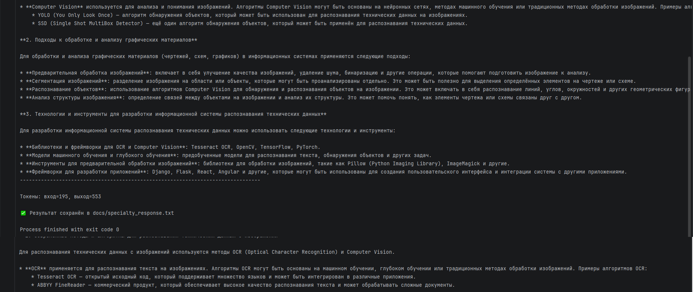

# Отчёт по лабораторной работе №1
## Дисциплина: Искусственный интеллект

---

## Общая информация

| Параметр            | Значение                                                                         |
|---------------------|----------------------------------------------------------------------------------|
| **Студент**         | ***                                                                              |
| **Группа**          | ФИТ-221                                                                          |
| **Дата выполнения** | 22.03.2026                                                                       |
| **Специальность**   | Фундаментальная информатика и информационные технологии                          |
| **Тема диплома**    | Информационная система распознавания технических данных с графических материалов |

---

## 1. Цель работы

Целью данной лабораторной работы является освоение базовых навыков настройки среды разработки для работы с технологиями 
искусственного интеллекта, а также получение практического опыта взаимодействия с API языковых моделей 
(в данном случае YandexGPT). В рамках работы необходимо изучить процесс получения доступа к AI-сервисам и реализовать 
программный вызов модели.

---

## 2. Выполненные задачи

- [X] Настроено окружение Python 3.10+
- [X] Создан GitHub-репозиторий
- [X] Получены API-ключи Yandex Cloud
- [X] Реализован базовый вызов API
- [X] Выполнен адаптированный запрос

---

## 3. Ход работы

### 3.1. Настройка окружения



```bash
# Команды установки
python --version
pip install -r requirements.txt
```

### 3.2. Создание репозитория

[Скриншот GitHub-репозитория]
- URL репозитория: `https://github.com/koden585/ai-course-labs`
- Текущая ветка: `week1`

### 3.3. Получение API-ключей



- Cloud ID: `b1g...`
- Folder ID: `b1g...`

### 3.4. Тестовый запрос

**Запрос:**
`Объясни кратко, что такое искусственный интеллект`

**Ответ:**
```
Искусственный интеллект (ИИ) — это область компьютерных наук, которая занимается созданием машин и программ, способных 
выполнять задачи, требующие интеллектуальных усилий, аналогичных тем, что выполняет человек. Это может включать в себя 
обучение на основе данных, решение сложных задач, распознавание образов, понимание естественного языка и принятие 
решений в условиях неопределённости. ИИ применяется в различных сферах, таких как медицина, финансы, транспорт и 
развлечения, для автоматизации процессов и улучшения эффективности.
```



### 3.5. Адаптированный запрос

**Специальность:** Фундаментальная информатика и информационные технологии

**Запрос:**
```
Я студент технической специальности "Фундаментальная информатика и информационные технологии", работаю над дипломной темой:
    "Информационная система распознавания технических данных с графических материалов"
    Прошу предоставить информацию по следующим вопросам:
    1. Какие современные методы и алгоритмы используются для распознавания технических данных с изображений (включая OCR и Computer Vision)?
    2. Какие подходы применяются для обработки и анализа графических материалов (чертежей, схем, графиков) в информационных системах?
    3. Какие технологии и инструменты (библиотеки, фреймворки, модели) рекомендуется использовать для разработки такой системы?
    Требования к ответу:
    • Ответ должен быть структурирован
    • Используй технические термины
    • Приведи конкретные примеры
    • Объём: 300-500 слов
```

**Ответ:**
```
**1. Современные методы и алгоритмы для распознавания технических данных с изображений**

Для распознавания технических данных с изображений используются методы OCR (Optical Character Recognition) и Computer Vision.

* **OCR** применяется для распознавания текста на изображениях. Алгоритмы OCR могут быть основаны на машинном обучении, глубоком обучении или традиционных методах обработки изображений. Примеры алгоритмов OCR:
    * Tesseract OCR — открытый исходный код, который поддерживает множество языков и может быть интегрирован в различные приложения.
    * ABBYY FineReader — коммерческий продукт, который обеспечивает высокое качество распознавания текста и может обрабатывать сложные документы.

* **Computer Vision** используется для анализа и понимания изображений. Алгоритмы Computer Vision могут быть основаны на нейронных сетях, методах машинного обучения или традиционных методах обработки изображений. Примеры алгоритмов Computer Vision:
    * YOLO (You Only Look Once) — алгоритм обнаружения объектов, который может быть использован для распознавания технических данных на изображениях.
    * SSD (Single Shot MultiBox Detector) — ещё один алгоритм обнаружения объектов, который может быть применён для распознавания технических данных.

**2. Подходы к обработке и анализу графических материалов**

Для обработки и анализа графических материалов (чертежей, схем, графиков) в информационных системах применяются следующие подходы:

* **Предварительная обработка изображений**: включает в себя улучшение качества изображений, удаление шума, бинаризацию и другие операции, которые помогают подготовить изображение к анализу.
* **Сегментация изображений**: разделение изображения на области или объекты, которые могут быть проанализированы отдельно. Это может быть полезно для выделения определённых элементов на чертеже или схеме.
* **Распознавание объектов**: использование алгоритмов Computer Vision для обнаружения и распознавания объектов на изображении. Это может включать в себя распознавание линий, углов, окружностей и других геометрических фигур.
* **Анализ структуры изображения**: определение связей между объектами на изображении и анализ их структуры. Это может помочь понять, как элементы чертежа или схемы связаны друг с другом.

**3. Технологии и инструменты для разработки информационной системы распознавания технических данных**

Для разработки информационной системы распознавания технических данных можно использовать следующие технологии и инструменты:

* **Библиотеки и фреймворки для OCR и Computer Vision**: Tesseract OCR, OpenCV, TensorFlow, PyTorch.
* **Модели машинного обучения и глубокого обучения**: предобученные модели для распознавания текста, обнаружения объектов и других задач.
* **Инструменты для предварительной обработки изображений**: библиотеки для обработки изображений, такие как Pillow (Python Imaging Library), ImageMagick и другие.
* **Фреймворки для разработки приложений**: Django, Flask, React, Angular и другие, которые могут быть использованы для создания пользовательского интерфейса и интеграции системы с другими приложениями.
```




---

## 4. Результаты

| Критерий            | Статус |
|---------------------|--------|
| Окружение настроено | ✅      |
| Репозиторий создан  | ✅      |
| Ветка week1 создана | ✅      |
| API работает        | ✅      |
| Адаптация выполнена | ✅      |

---

## 5. Выводы

В ходе выполнения лабораторной работы была настроена среда разработки и реализовано взаимодействие с API языковой 
модели. Получен практический опыт работы с облачными AI-сервисами, включая авторизацию, получение токенов и выполнение 
запросов. Освоенные подходы могут быть полезны при разработке интеллектуальных систем, в том числе связанных с 
обработкой и анализом данных. Полученные знания могут быть использованы в дальнейшей учебной и профессиональной 
деятельности.

---

## 6. Список источников
1. Yandex Cloud Documentation. URL: https://cloud.yandex.ru/docs/
2. LangChain Documentation. URL: https://python.langchain.com/
3. GitHub Documentation. URL: https://docs.github.com/