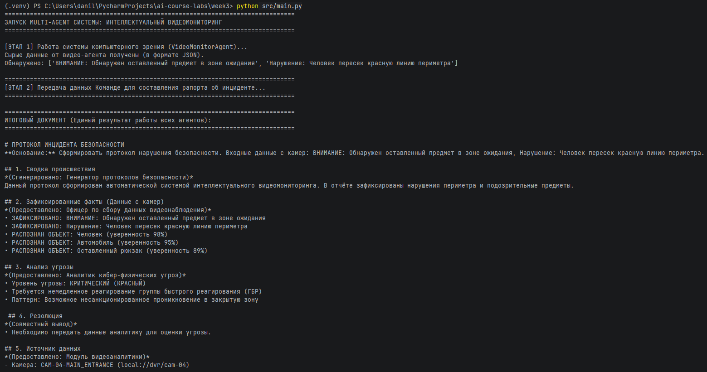
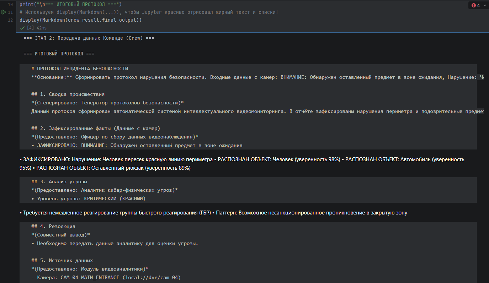

# Отчёт по лабораторной работе №3
## Дисциплина: Искусственный интеллект

---

## Общая информация
| Параметр            | Значение                                                  |
|---------------------|-----------------------------------------------------------|
| **Студент**         | ***                                                       |
| **Группа**          | ФИТ-221                                                   |
| **Дата выполнения** | 11.04.2026                                                |
| **Специальность**   | Фундаментальная информатика и информационные технологии   |
| **Тема диплома**    | Информационная система интеллектуального видеомониторинга |

---

## 1. Цель работы
Изучить архитектурные паттерны многоагентных систем (Multi-Agent Systems) и 
реализовать последовательный конвейер (pipeline) из нескольких специализированных ИИ-агентов. 
Адаптировать систему для интеграции с темой дипломной работы (анализ видеопотока).

---

## 2. Выполненные задачи
- [X] Изучены архитектурные паттерны MAS
- [X] Реализовано минимум 3 агента
- [X] Создана команда агентов (Crew)
- [X] Реализована специализация под диплом
- [X] Написаны тесты
- [X] Код загружен в GitHub

---

## 3. Ход работы

### 3.1. Архитектура Multi-Agent системы
Был выбран паттерн **Pipeline Processing** (последовательный конвейер).

Архитектура: `VideoMonitorAgent (Сбор CV данных) -> Researcher (Парсинг фактов) -> Analyst (Оценка угроз) -> Writer (Генерация протокола)`

### 3.2. Реализованные агенты
| Агент             | Роль                  | Назначение                           |
|-------------------|-----------------------|--------------------------------------|
| ResearcherAgent   | Исследователь         | Сбор информации                      |
| AnalystAgent      | Аналитик              | Анализ данных                        |
| WriterAgent       | Писатель              | Генерация отчётов                    |
| VideoMonitorAgent | Модуль видеоаналитики | Детекция объектов, трекинг, аномалии |

### 3.3. Специализированный агент
**Описание адаптированного агента:**
`VideoMonitorAgent` — специализированный ИИ-агент, эмулирующий работу модуля компьютерного зрения. 
Назначение: Анализ видеопотоков с камер наблюдения в реальном времени, детекция объектов (Object Detection), трекинг и выявление аномалий (оставленные предметы, пересечение периметра).

**Листинг кода (`src/agents/video_monitor_agent.py`):**
```python
import time
import logging
from typing import Dict, Optional, List
from agents.base_agent import BaseAgent, AgentConfig

logger = logging.getLogger(__name__)

class VideoMonitorAgent(BaseAgent):
    def __init__(self, config: Optional[AgentConfig] = None):
        default_config = AgentConfig(
            role="Модуль видеоаналитики (CV/Surveillance)",
            goal="Анализ видео с камер наблюдения в реальном времени, детекция объектов и аномалий",
            backstory="Вы — ИИ-модуль системы интеллектуального видеомониторинга. Ваша задача — анализировать кадры, находить нарушения периметра, забытые вещи и отслеживать перемещения."
        )
        super().__init__(config or default_config)

    def execute_task(self, task_description: str, context: Optional[Dict] = None) -> Dict:
        start_time = time.time()
        self.state.current_task = task_description
        
        results = {
            "task": task_description,
            "status": "completed",
            "camera_id": "CAM-04-MAIN_ENTRANCE",
            "detected_objects":["Человек (уверенность 98%)", "Оставленный рюкзак (уверенность 89%)"],
            "anomalies":["ВНИМАНИЕ: Обнаружен оставленный предмет", "Нарушение: Человек пересек красную линию"],
            "execution_time": time.time() - start_time
        }
        
        self.state.completed_tasks.append(task_description)
        self.statistics["tasks_completed"] += 1
        return results

    def get_capabilities(self) -> List[str]:
        return["Детекция объектов", "Трекинг", "Поиск аномалий поведения"]
```

```python
# Инициализация и запуск агента
video_agent = VideoMonitorAgent()
video_result = video_agent.execute_task("Анализ видеопотока с камеры CAM-04")

# Извлечение найденных аномалий
print("Найденные нарушения:", video_result['anomalies'])
```  

### 3.4. Координация между агентами
Координация реализована через центральный класс `ResearchCrew`. 

Данные передаются через `shared_context` (словарь). Видео-агент формирует JSON с инцидентом, который затем обогащается на каждом этапе (исследование -> анализ -> форматирование).

### 3.5. Тестирование
```text
================================================================================
ЗАПУСК MULTI-AGENT СИСТЕМЫ: ИНТЕЛЛЕКТУАЛЬНЫЙ ВИДЕОМОНИТОРИНГ
================================================================================

[ЭТАП 1] Работа системы компьютерного зрения (VideoMonitorAgent)...
Сырые данные от видео-агента получены (в формате JSON).
Обнаружено: ['ВНИМАНИЕ: Обнаружен оставленный предмет в зоне ожидания', 'Нарушение: Человек пересек красную линию периметра']

================================================================================
[ЭТАП 2] Передача данных Команде для составления рапорта об инциденте...
================================================================================

================================================================================
ИТОГОВЫЙ ДОКУМЕНТ (Единый результат работы всех агентов):
================================================================================

# ПРОТОКОЛ ИНЦИДЕНТА БЕЗОПАСНОСТИ
**Основание:** Сформировать протокол нарушения безопасности. Входные данные с камер: ВНИМАНИЕ: Обнаружен оставленный предмет в зоне ожидания, Нарушение: Человек пересек красную линию периметра.

## 1. Сводка происшествия
*(Сгенерировано: Генератор протоколов безопасности)*
Данный протокол сформирован автоматической системой интеллектуального видеомониторинга. В отчёте зафиксированы нарушения периметра и подозрительные предметы.

## 2. Зафиксированные факты (Данные с камер)
*(Предоставлено: Офицер по сбору данных видеонаблюдения)*
• ЗАФИКСИРОВАНО: ВНИМАНИЕ: Обнаружен оставленный предмет в зоне ожидания
• ЗАФИКСИРОВАНО: Нарушение: Человек пересек красную линию периметра
• РАСПОЗНАН ОБЪЕКТ: Человек (уверенность 98%)
• РАСПОЗНАН ОБЪЕКТ: Автомобиль (уверенность 95%)
• РАСПОЗНАН ОБЪЕКТ: Оставленный рюкзак (уверенность 89%)

## 3. Анализ угрозы
*(Предоставлено: Аналитик кибер-физических угроз)*
• Уровень угрозы: КРИТИЧЕСКИЙ (КРАСНЫЙ)
• Требуется немедленное реагирование группы быстрого реагирования (ГБР)
• Паттерн: Возможное несанкционированное проникновение в закрытую зону

 ## 4. Резолюция
*(Совместный вывод)*
• Необходимо передать данные аналитику для оценки угрозы.

## 5. Источник данных
*(Предоставлено: Модуль видеоаналитики)*
- Камера: CAM-04-MAIN_ENTRANCE (local://dvr/cam-04)
```
Скриншоты работы:




### 3.6. Интеграция с дипломом
Данная многоагентная архитектура идеально подходит для дипломной работы. Вместо заглушек (mocks) VideoMonitorAgent может быть подключен к реальной CV-модели (например, YOLO или OpenCV), а текстовые агенты могут работать через API YandexGPT, автоматически формируя отчеты для службы безопасности по каждому инциденту.

---

## 4. Результаты
| Критерий                | Статус |
|-------------------------|--------|
| Агенты работают         | ✅      |
| Координация настроена   | ✅      |
| Специализация выполнена | ✅      |
| Код в GitHub            | ✅      |

---

## 5. Выводы
В ходе лабораторнйо работы применил концепцию Multi-Agent Systems. Было доказано, что разделение сложной задачи на простых специализированных агентов (сбор, анализ, написание) позволяет получить структурированный и точный результат. Архитектура была успешно адаптирована под задачу интеллектуального видеомониторинга.

---

## 6. Список источников
1. Yandex Cloud Documentation. URL: https://cloud.yandex.ru/docs/
2. LangChain Documentation. URL: https://python.langchain.com/
3. GitHub Documentation. URL: https://docs.github.com/