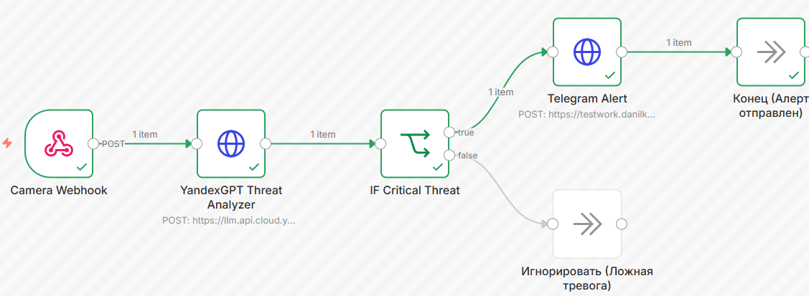
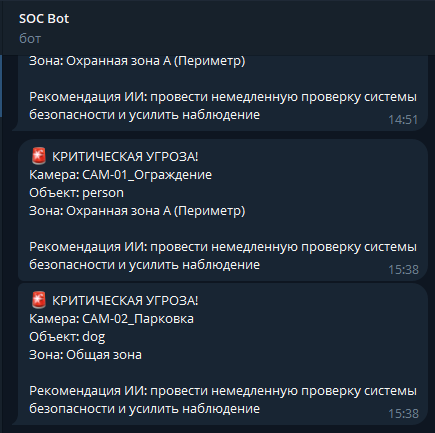

# Отчёт по лабораторной работе №4
## Дисциплина: Искусственный интеллект

---

## Общая информация

| Параметр            | Значение                                                  |
|---------------------|-----------------------------------------------------------|
| **Студент**         | ***                                                       |
| **Группа**          | ФИТ-221                                                   |
| **Дата выполнения** | 04.05.2026                                                |
| **Специальность**   | Фундаментальная информатика и информационные технологии   |
| **Тема диплома**    | Информационная система интеллектуального видеомониторинга |

---

## 1. Цель работы

Освоить принципы автоматизации рабочих процессов (Workflow Automation). Развернуть Low-Code платформу n8n через Docker
и создать автоматизированный конвейер реагирования на инциденты безопасности с интеграцией нейросети YandexGPT для 
оценки уровня угрозы.

---

## 2. Выполненные задачи

- [X] Развёрнута платформа автоматизации (n8n/ApiX-Drive)
- [X] Создан базовый workflow
- [X] Интегрирован российский LLM API
- [X] Реализовано ветвление логики
- [X] Создан специализированный workflow
- [X] Код загружен в GitHub

---

## 3. Ход работы

### 3.1. Настройка платформы

Платформа n8n была развернута локально с использованием Docker Compose (образы `n8nio/n8n:latest` и `postgres:15-alpine`).
Конфигурация включает проброс портов (5678) и подключение volumes для хранения данных. Переменные окружения (ключи API) 
вынесены в отдельный `.env` файл для обеспечения безопасности (Security Best Practices).

### 3.2. Базовый workflow

Был спроектирован базовый процесс классификации входящих заявок технической поддержки с использованием LLM и ветвлением 
логики (сохранен в `basic_workflow.json`).

### 3.3. Интеграция с YandexGPT/GigaChat

Для анализа инцидентов был интегрирован YandexGPT. Настроен HTTP Request узел с передачей IAM-токена и Folder_ID в заголовках (`Authorization: Bearer...`).

**Промпт (System):**

> Ты ИИ-аналитик системы интеллектуального видеомониторинга. На вход поступают JSON-данные от нейросети YOLO. Оцени угрозу. Верни СТРОГО валидный JSON без разметки markdown: {"level": "critical" или "low", "recommendation": "краткое действие"}.

### 3.4. Специализированный workflow

Был разработан workflow `specialty_workflow.json` для автоматизации дипломного проекта.

**Сценарий:**

1. **Camera Webhook:** Принимает POST-запрос с JSON от нейросети YOLO (камера, класс объекта `person`, геозона).
2. **YandexGPT Threat Analyzer:** ИИ анализирует, представляет ли данный объект в данной геозоне угрозу.
3. **IF Critical Threat:** Блок логики парсит JSON от Яндекса. Если `level == "critical"`, сигнал идет по ветке `true`.
4. **Telegram Alert:** Отправка экстренного уведомления начальнику смены охраны через кастомный Cloudflare Worker Proxy.

### 3.5. Тестирование

Для тестирования был написан Python-скрипт `webhook_handler.py`, симулирующий отправку данных от YOLO.

### 3.6. Интеграция с дипломом

Данный workflow представляет собой готовый Production-ready модуль для системы видеомониторинга. 
Он полностью автоматизирует процесс принятия решений (Decision Making) на основе сырых данных компьютерного зрения (YOLO). 
Использование YandexGPT позволяет гибко интерпретировать контекст (например, отличать сотрудника с пропуском от нарушителя в маске), а Cloudflare Proxy обеспечивает безотказную доставку алертов.

### 3.7. Инструкция по запуску пайплайна (Demo Guide)

Для развертывания и тестирования автоматизированной системы необходимо выполнить следующие шаги:

**1. Запуск инфраструктуры (Docker)**
- Убедиться, что запущен Docker Desktop.
- В терминале перейти в директорию `week4/docker`.
- Выполнить команду `docker-compose up -d` для старта n8n и PostgreSQL.

**2. Настройка n8n**
- Открыть браузер по адресу `http://localhost:5678`.
- Импортировать схему `specialty_workflow.json` из папки `workflows`.
- Заполнить ключи авторизации (Yandex IAM Token, Folder ID, Telegram Bot Token) в соответствующих узлах.
- Нажать кнопку **Execute workflow** (для перехода в режим ожидания вебхука).

**3. Имитация событий видеоаналитики**
- Открыть Jupyter Notebook `lab4_workflow_demo.ipynb` в папке `notebooks`.
- Запустить Ячейку 1 для инициализации функций.
- Запустить Ячейку 2 для имитации **критической угрозы** (сработает ветка `true` -> придет сообщение в Telegram).
- Либо в консоли `python src/webhook_handler.py`

**4. Завершение работы**
- Для безопасной остановки системы выполнить в терминале `docker-compose down`.

---

## 4. Результаты

| Критерий                | Статус |
|-------------------------|--------|
| Платформа развёрнута    | ✅      |
| Workflow работает       | ✅      |
| AI интегрирован         | ✅      |
| Специализация выполнена | ✅      |
| Код в GitHub            | ✅      |

---

## 5. Выводы

В ходе работы ознакомились с платформой n8n. 
Было доказано, что Low-Code инструменты в связке с LLM позволяют в кратчайшие сроки собирать сложные конвейеры автоматизации (от приема Webhook до отправки уведомлений в мессенджеры). 
Решена проблема парсинга Markdown-ответов от ИИ с помощью регулярных выражений и настроен прокси для Telegram API.

---

## 6. Список источников
1. Yandex Cloud Documentation. URL: https://cloud.yandex.ru/docs/
2. LangChain Documentation. URL: https://python.langchain.com/
3. GitHub Documentation. URL: https://docs.github.com/