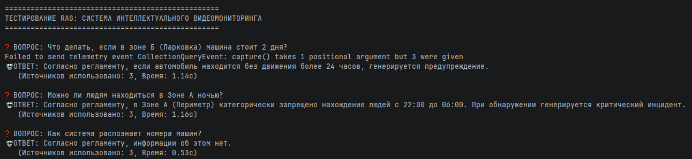

# Отчёт по лабораторной работе №5
## Дисциплина: Искусственный интеллект

---

## Общая информация

| Параметр            | Значение                                                  |
|---------------------|-----------------------------------------------------------|
| **Студент**         | ***                                                       |
| **Группа**          | ФИТ-221                                                   |
| **Дата выполнения** | 06.05.2026                                                |
| **Специальность**   | Фундаментальная информатика и информационные технологии   |
| **Тема диплома**    | Информационная система интеллектуального видеомониторинга |

---

## 1. Цель работы
Изучить архитектуру RAG (Retrieval-Augmented Generation) и создать систему поиска и генерации ответов по собственной 
базе знаний, исключающую галлюцинации языковой модели. Адаптировать систему под предметную область дипломного проекта.

---

## 2. Выполненные задачи
- [X] Настроены зависимости LangChain + ChromaDB
- [X] Реализована загрузка документов
- [X] Настроено разбиение на чанки
- [X] Создано векторное хранилище
- [X] Реализован RAG пайплайн
- [X] Выполнена адаптация под специальность
- [X] Код загружен в GitHub

---

## 3. Ход работы

### 3.1. Архитектура RAG системы

В работе реализован классический RAG-пайплайн (Indexing Pipeline + Query Pipeline). 
Векторизация документов производится локально (на CPU) для обеспечения конфиденциальности данных, 
а генерация ответа вынесена в облако YandexGPT.

### 3.2. Настроенные компоненты

| Компонент       | Реализация                           | Параметры                                     |
|-----------------|--------------------------------------|-----------------------------------------------|
| Document Loader | `DocumentLoader` (PyPDF, TextLoader) | Поддержка: .pdf, .txt, .md                    |
| Chunking        | `RecursiveCharacterTextSplitter`     | Size: 512, Overlap: 50                        |
| Embeddings      | `HuggingFaceEmbeddings`              | Модель: paraphrase-multilingual-MiniLM-L12-v2 |
| Vector Store    | `Chroma`                             | Local persist directory: `./data/chroma_db`   |
| LLM             | `YandexGPT`                          | Temperature: 0.1, Max Tokens: 500             |

### 3.3. Документы для индексации

Для системы был написан специализированный текстовый документ `video_surveillance.txt`, содержащий регламент работы 
ИИ-системы видеонаблюдения: правила охранных зон (периметр, парковка, серверная) и логику обработки аномалий детекции (YOLO26).
Статистика: проиндексировано 3 чанка данных.

### 3.4. Тестовые запросы и ответы

| № | Запрос                                                   | Ответ (кратко)                                    | Источников | Время |
|---|----------------------------------------------------------|---------------------------------------------------|------------|-------|
| 1 | Что делать, если в зоне Б (Парковка) машина стоит 2 дня? | Генерируется предупреждение (т.к. более 24 часов) | 3          | 1.14с |
| 2 | Можно ли людям находиться в Зоне А ночью?                | Запрещено с 22:00 до 06:00                        | 3          | 1.16с |
| 3 | Как система распознает номера машин?                     | Согласно регламенту, информации об этом нет       | 3          | 0.53с |

Также работа продемонстрирована в lab5_rag_demo.ipynb.

### 3.5. Адаптация под специальность

Система `VideoSurveillanceRAG` содержит специализированный системный промпт, требующий отвечать СТРОГО по регламенту службы безопасности. Это предотвращает галлюцинации LLM. 
**Интеграция с дипломом:** Разработанная система может стать основой для "ИИ-ассистента оператора", который в режиме реального времени будет подсказывать сотрудникам службы безопасности инструкции по реагированию на инциденты, зафиксированные камерами.

### 3.6. Проблемы и решения

Не выявлено

---

## 4. Результаты
| Критерий                | Статус |
|-------------------------|--------|
| RAG работает            | ✅      |
| Документы индексированы | ✅      |
| Поиск релевантный       | ✅      |
| Специализация выполнена | ✅      |
| Код в GitHub            | ✅      |

---

## 5. Выводы

В ходе выполнения работы была успешно развернута архитектура RAG. Доказана её эффективность в борьбе с галлюцинациями LLM: на вопросы, не освещенные в корпоративной базе знаний, модель отвечает отказом, а не генерирует ложные факты. Локальная база ChromaDB показала высокую скорость работы.

---

## 6. Список источников
1. Yandex Cloud Documentation. URL: https://cloud.yandex.ru/docs/
2. GitHub Documentation. URL: https://docs.github.com/