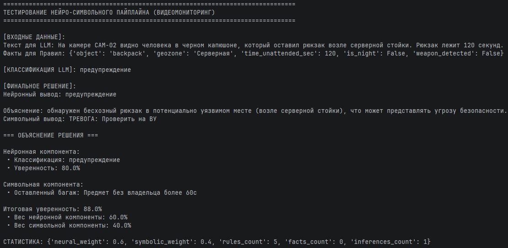
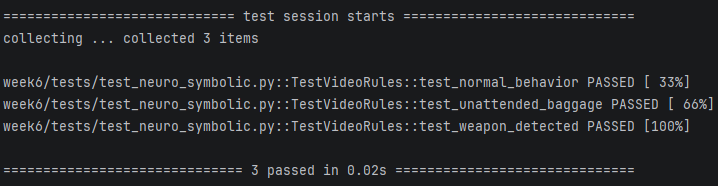

# Отчёт по лабораторной работе №6
## Дисциплина: Искусственный интеллект

---

## Общая информация
| Параметр            | Значение                                                  |
|---------------------|-----------------------------------------------------------|
| **Студент**         | ***                                                       |
| **Группа**          | ФИТ-221                                                   |
| **Дата выполнения** | 07.05.2026                                                |
| **Специальность**   | Фундаментальная информатика и информационные технологии   |
| **Тема диплома**    | Информационная система интеллектуального видеомониторинга |

---

## 1. Цель работы

Разработать и протестировать нейро-символьную (Neuro-Symbolic) интеллектуальную систему, объединяющую вероятностный 
вывод языковой модели (YandexGPT) с детерминированным символьным движком правил (Rule Engine). 
Адаптировать гибридную систему для задач дипломного проекта.

---

## 2. Выполненные задачи
- [X] Реализован Rule Engine
- [X] Интегрирован LLM клиент
- [X] Создан гибридный пайплайн
- [X] Разработано минимум 5 правил
- [X] Выполнена адаптация под специальность
- [X] Код загружен в GitHub

---

## 3. Ход работы

### 3.1. Архитектура системы

Был выбран паттерн **Parallel Neural-Symbolic Pipeline** (Уровень 2 интеграции по глубине связи). 
Данные от камер наблюдения параллельно обрабатываются LLM (для извлечения контекста) и Rule Engine 
(для проверки жестких ограничений), после чего результаты взвешенно комбинируются.

### 3.2. Реализованные компоненты

| Компонент   | Файл                         | Назначение                                        |
|-------------|------------------------------|---------------------------------------------------|
| Rule Engine | `symbolic/rule_engine.py`    | Детерминированный логический вывод                |
| LLM Client  | `neural/llm_client.py`       | Вероятностная нейронная генерация и классификация |
| Pipeline    | `neuro_symbolic/pipeline.py` | Интеграция выводов, генерация объяснений (XAI)    |

### 3.3. Разработанные правила

| ID      | Название                    | Приоритет | Вывод                                 |
|---------|-----------------------------|-----------|---------------------------------------|
| VID_001 | Ночное проникновение        | CRITICAL  | КРИТИЧЕСКАЯ ТРЕВОГА: Вызов ГБР        |
| VID_002 | Оставленный багаж           | HIGH      | ТРЕВОГА: Проверить на ВУ              |
| VID_003 | Транспорт в пешеходной зоне | MEDIUM    | ПРЕДУПРЕЖДЕНИЕ: Оповестить парковщика |
| VID_004 | Массовое скопление          | LOW       | ИНФО: Включить вентиляцию             |
| VID_005 | Обнаружение оружия          | CRITICAL  | БЛОКИРОВКА ДВЕРЕЙ, ВЫЗОВ ПОЛИЦИИ      |

### 3.4. Тестовые сценарии

**Входные данные:** Человек в капюшоне оставил рюкзак возле серверной стойки (120 секунд).

**Нейронный вывод:** Классификация: "предупреждение".

**Символьный вывод:** Сработало правило VID_002 (Предмет без владельца > 60с).

**Итог:** Интеграция повысила уверенность системы до 88%. Сгенерировано объяснение, опирающееся на жесткий регламент безопасности.

### 3.5. Объяснимость решений

Интеграционный слой формирует блок `=== ОБЪЯСНЕНИЕ РЕШЕНИЯ ===`, в котором четко разделен вклад нейросети (уверенность 80%) и сработавших детерминированных правил (Rule: Оставленный багаж).

**Как это помогает в дипломе:** Это критически важно для систем безопасности. Оператор видеонаблюдения видит не просто "черный ящик" (почему сработала тревога?), а конкретное логическое обоснование, основанное на регламенте объекта.

---

## 4. Результаты
| Критерий                | Статус |
|-------------------------|--------|
| Пайплайн работает       | ✅      |
| Правила срабатывают     | ✅      |
| LLM интегрирован        | ✅      |
| Специализация выполнена | ✅      |
| Код в GitHub            | ✅      |

---

## 5. Выводы

Нейро-символьный подход доказал свою высочайшую эффективность для задач критической безопасности. 
Использование LLM позволяет гибко анализировать неструктурированные текстовые логи с камер, 
а символьный движок гарантирует 100% соблюдение техники безопасности и исключает опасные "галлюцинации" искусственного интеллекта.

---

## 6. Список источников
1. Yandex Cloud Documentation. URL: https://cloud.yandex.ru/docs/
2. GitHub Documentation. URL: https://docs.github.com/