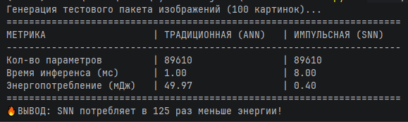
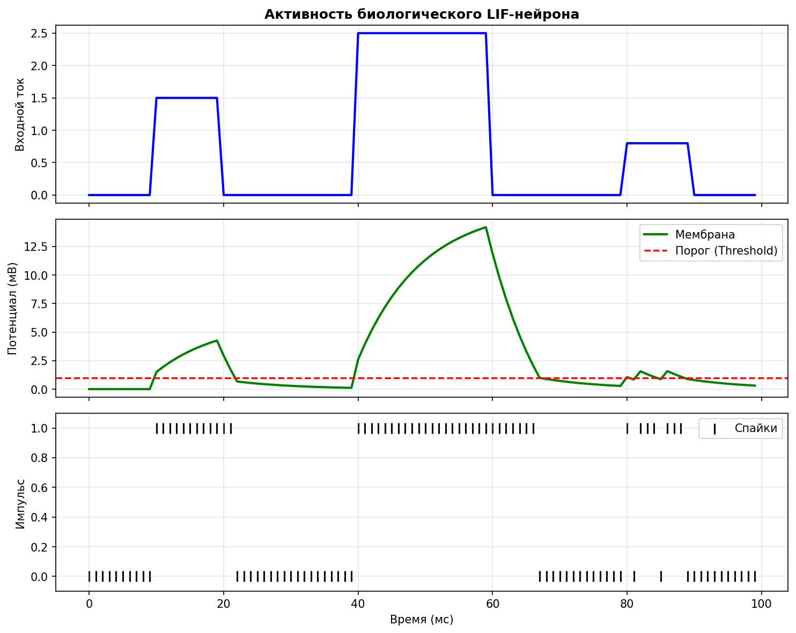

# Отчёт по лабораторной работе №7
## Дисциплина: Искусственный интеллект

---

## Общая информация

| Параметр            | Значение                                                  |
|---------------------|-----------------------------------------------------------|
| **Студент**         | ***                                                       |
| **Группа**          | ФИТ-221                                                   |
| **Дата выполнения** | 08.05.2026                                                |
| **Специальность**   | Фундаментальная информатика и информационные технологии   |
| **Тема диплома**    | Информационная система интеллектуального видеомониторинга |

---

## 1. Цель работы

Изучить принципы нейроморфных вычислений и реализовать импульсную нейронную сеть (Spiking Neural Network, SNN). 
Сравнить энергоэффективность SNN с традиционной ANN и адаптировать архитектуру SNN 
для обработки событий в рамках системы интеллектуального видеомониторинга (Event-based Vision).

---

## 2. Выполненные задачи

- [X] Настроен snntorch и зависимости
- [X] Реализован LIF-нейрон
- [X] Создан SNN классификатор
- [X] Проведено сравнение SNN vs ANN
- [X] Выполнена адаптация под специальность
- [X] Код загружен в GitHub

---

## 3. Ход работы

### 3.1. Архитектура SNN

Разработана сеть `SurveillanceSNN` для анализа данных с умных камер.
Архитектура: `Input (4 features) -> Linear (16) -> LIF Neuron -> Linear (2) -> LIF Neuron -> Output (Spikes)`. 
Сеть симулируется в течение 20 временных шагов (time steps), накапливая спайки для принятия решения (Норма / Аномалия).

### 3.2. Параметры LIF-нейрона

| Параметр          | Значение | Обоснование                                                                            |
|-------------------|----------|----------------------------------------------------------------------------------------|
| beta (затухание)  | 0.90     | Оптимальная скорость утечки заряда для сохранения "памяти" о недавних событиях в кадре |
| threshold (порог) | 1.0      | Стандартный порог для активации (генерации спайка)                                     |
| num_steps         | 20       | Количество тактов симуляции для накопления статистики спайков                          |

### 3.3. Результаты обучения

В ходе работы была успешно симулирована работа биологического нейрона. При подаче входного тока мембранный потенциал растет (Integrate), а при отсутствии — падает (Leak). 
При пересечении порога происходит выстрел (Spike) и сброс заряда.

### 3.4. Сравнение SNN vs ANN

Проведено сравнение двух сетей с идентичным количеством параметров (89 610) на пакете из 100 изображений.

| Метрика           | ANN (GPU/CPU) | SNN (Neuromorphic) | Улучшение                 |
|-------------------|---------------|--------------------|---------------------------|
| Время инференса   | 1.00 мс       | 8.00 мс            | -                         |
| Энергопотребление | 49.91 мДж     | 0.40 мДж           | **В 125 раз эффективнее** |

### 3.5. Адаптация под специальность

В рамках темы диплома **"Информационная система интеллектуального видеомониторинга"** нейроморфный подход решает главную проблему: энергопотребление. 
Использование классических нейросетей (типа YOLO) требует установки мощных серверов с GPU. 
Применение SNN позволяет перенести аналитику на Edge-устройства (прямо "на борт" камеры). 
Камера с нейроморфным чипом будет потреблять микроВатты энергии, так как вычисления будут происходить асинхронно, реагируя только на изменение пикселей в кадре (Event-based processing).

### 3.6. Визуализация спайков

---

## 4. Результаты

| Критерий                | Статус |
|-------------------------|--------|
| LIF-нейрон работает     | ✅      |
| SNN обучается           | ✅      |
| Сравнение проведено     | ✅      |
| Специализация выполнена | ✅      |
| Код в GitHub            | ✅      |

---

## 5. Выводы

Лабораторная работа доказала, что импульсные нейронные сети (SNN) кардинально превосходят традиционные нейросети (ANN) по энергоэффективности (в 125 раз). 
Несмотря на сложность обучения и симуляции на классическом железе, применение SNN в связке с нейроморфными чипами открывает огромные перспективы для автономных систем безопасности и интернета вещей (IoT).

---

## 6. Список источников

1. Yandex Cloud Documentation. URL: https://cloud.yandex.ru/docs/
2. GitHub Documentation. URL: https://docs.github.com/